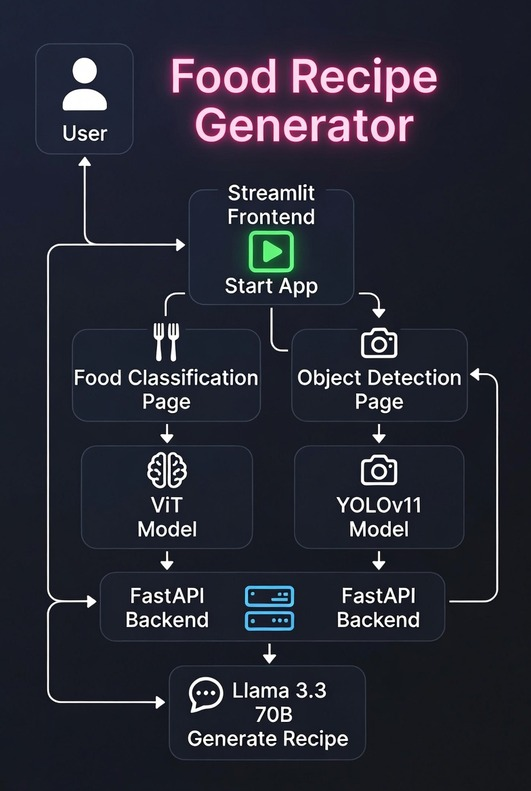

# 🍽️ Food Recipe Generator



A modern, dark-themed architecture diagram of a Food Recipe Generator application built with Streamlit (frontend) and FastAPI (backend). It shows two main paths: food classification using a ViT model (trained on Food-101) and ingredient/object detection using YOLOv11, both feeding detected items into Llama 3.3 70B to generate relevant recipes, with clean neon accents and a sleek AI-app layout.


---

## 🌟 Features

- *Food Recognition + Recipe Generation*  
  Upload any food photo → model detects what it is → LLM generates a complete recipe

- *Ingredient-based Dish Suggestions*  
  Upload a photo of fruits & vegetables → model identifies them → LLM suggests creative dishes you can make

- Modern, clean *Streamlit* user interface  
- Fast & production-ready *FastAPI* backend  
- Two main API endpoints:
  - POST /api/v1/generate-recipe  
  - POST /api/v1/suggest-dishes

## 🛠️ Tech Stack

| Layer              | Technology / Library                           |
|--------------------|------------------------------------------------|
| Backend            | FastAPI, Uvicorn                               |
| Frontend           | Streamlit                                      |
| Image Processing   | Pillow                                         |
| Computer Vision    | Ultralytics (YOLO), Transformers               |
| Models             | nateraw/food (food classification) <br> yolo_fruits_and_vegetables_v3.pt (YOLO) |
| LLM                | Llama-3.3-70b-versatile (via Groq)             |
| LLM Integration    | LangChain + Groq                               |
| Environment        | python-dotenv                                  |
| File Upload        | python-multipart                               |
| HTTP Client        | requests                                       |
| Deep Learning      | PyTorch, transformers                          |


## 📁 Project structure

food-suggestor-recipe-generator
├── 🧠 model
│   ├── food_detection.py          # Food classifier (nateraw/food)
│   ├── ingredients_detection.py   # YOLO fruits & veg
│   └── yolov_fruits_and_vegetables_v3.pt
├── 🔑 .env
├── 📦 requirements.txt
├── 🚀 run_all.py
├── 🍳 gen_recipe.py               # LLM recipe & suggestion logic
├── ⚡ main.py                     # FastAPI backend
└── 🖥️ streamlit_app.py           # Streamlit frontend

## ⚙️ Setup

### 1. Clone the repository
```bash
git clone https://github.com/Ali-Azhar-786/food-recipe-generator.git
cd food-recipe-generator
```
### 2. Create virtual environment & install dependencies 
```bash
python -m venv venv
source venv/bin/activate    # Linux / macOS
# or on Windows: venv\Scripts\activate
pip install -r requirements.txt
```

### 3. Create .env file
GROQ_API_KEY=your_groq_api_key_here
Optional: PORT=8000

### 4. Run the backend (FastAPI)
uvicorn main:app --reload --port 8000
or use the script if you have one: python run_backend.py

### 5. Run the frontend (Streamlit)
In a new terminal:
Bash
streamlit run app.py
usually opens at http://localhost:8501